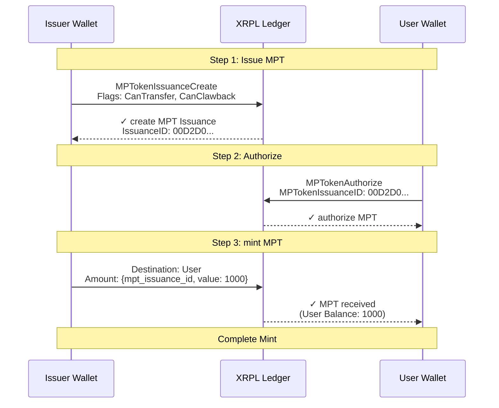
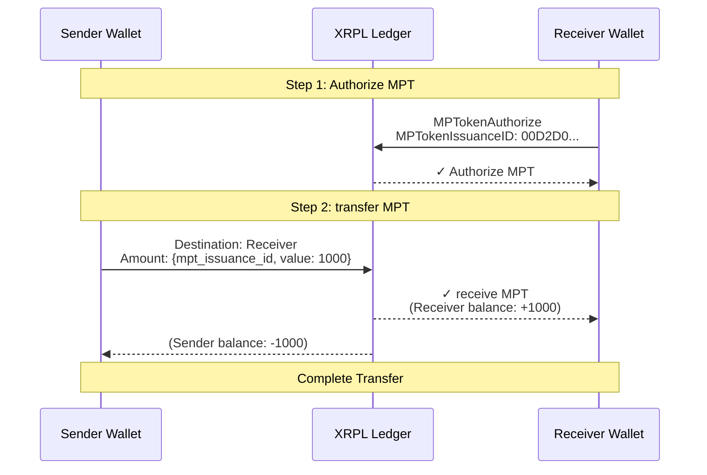
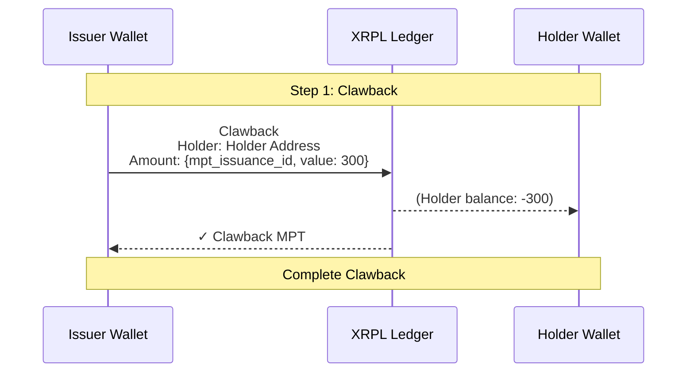

# MPT Operation Flow Sequence Diagrams (XRPL Transactions)

This document shows the flow of transactions executed on XRPL.

## 1. Mint Operation

## 2. Transfer Operation

## 3. Burn Operation (Clawback)

## Transaction Details

### Mint Operation Transactions
1. **MPTokenIssuanceCreate** - Creates MPT issuance settings
   - `AssetScale`: Decimal places (fixed to 0)
   - `MaximumAmount`: Maximum supply (same as mint amount)
   - `TransferFee`: Transfer fee (fixed to 0)
   - `Flags`: `CanTransfer` (transferable) + `CanClawback` (clawback enabled)

2. **MPTokenAuthorize** - User authorizes MPT receipt
   - Creates MPToken object (prepares for receipt)

3. **Payment** - Sends MPT from Issuer to User
   - `Amount`: `{mpt_issuance_id: "...", value: "1000"}`

### Transfer Operation Transactions
1. **MPTokenAuthorize** - Receiver authorizes receipt
2. **Payment** - Sends MPT from Sender to Receiver

### Burn Operation Transactions
1. **Clawback** - Issuer forcibly retrieves MPT from Holder
   - Only Issuer can execute Clawback
   - Forcibly retrieves without Holder's approval
